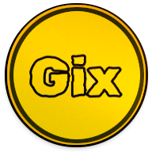
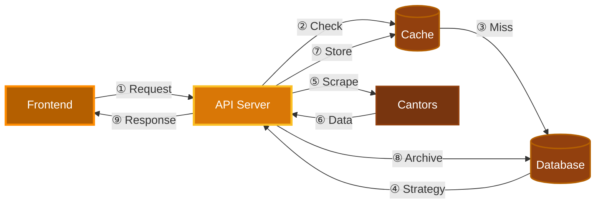

<div align="center">

<!-- Logo placeholder - replace with your actual logo -->


# GIX

*Real-time Currency Exchange Monitor*

[](https://go.dev)
[](https://www.docker.com)
[](LICENSE)

</div>

---

## Architecture



### Data Flow Pipeline

<div align="center">

| Step | Action | Description |
|:----:|--------|-------------|
| **①** | **Request** | Frontend → API: `ex. GET /api/v1/rates?cantor_id=1&currency=EUR` |
| **②** | **Cache Check** | API checks Redis for cached rates (60s TTL) |
| **③** | **Cache Result** | **Hit**: Return immediately / **Miss**: Query database |
| **④** | **Get Strategy** | Database returns scraping strategy (C1, C2, or C3) |
| **⑤** | **Scrape** | API executes strategy-specific scraper using Goquery |
| **⑥** | **HTML Response** | External cantor returns exchange rate data |
| **⑦** | **Cache Update** | Store fresh data in Redis (60s expiry) |
| **⑧** | **Archive** | Async save to TimescaleDB for historical analysis |
| **⑨** | **JSON Response** | API → Frontend: Return formatted exchange rates |

</div>

## Technology Stack

<div align="center">

| Component | Technology | Purpose |
|:---------:|:----------:|---------|
| **Frontend** | Go + Gio UI | Native cross-platform desktop app |
| **Backend** | Go + net/http | REST API server with hot-reload (Air) |
| **Cache** | Redis | 60-second TTL for rate limiting scraping |
| **Database** | TimescaleDB | Time-series optimized PostgreSQL |
| **Scraping** | Goquery | Strategy Pattern for different cantor layouts |
| **Container** | Docker Compose | Single-command dev environment |

</div>

## Quick Start

### Prerequisites

Make sure you have installed:
- [](https://www.docker.com/products/docker-desktop/)
- [](https://go.dev/doc/install)

### Launch

**1.** Start Docker Desktop

**2.** Run the application:

```bash
# Terminal 1: Start backend (API + DB + Cache)
docker-compose up

# Terminal 2: Start frontend
go run ./cmd/gix/main.go
```

---

## Demo

<div align="center">


</div>

---
</div>
