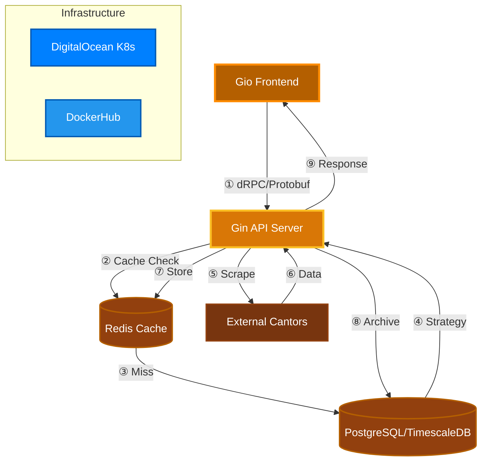

<div align="center">
    


# GIX

*Real-time Currency Exchange Monitor (PLN-based)*

[](https://go.dev)
[](https://www.docker.com)
[](LICENSE)

[](https://sonarcloud.io/summary/new_code?id=Niutaq_Gix)

---
</div>

## Architecture



### Data Flow Pipeline


| Step  | Action            | Description                                             |
|:-----:|-------------------|---------------------------------------------------------|
| **①** | **Request**       | Frontend → API: dRPC call with Protobuf payload         |
| **②** | **Cache Check**   | API checks Redis for cached rates (60s TTL)             |
| **③** | **Cache Result**  | **Hit**: Return immediately / **Miss**: Query database  |
| **④** | **Get Strategy**  | Database returns scraping strategy (selectors & logic)  |
| **⑤** | **Scrape**        | API executes strategy-specific scraper using Goquery    |
| **⑥** | **HTML Response** | External cantor returns exchange rate data              |
| **⑦** | **Cache Update**  | Store fresh data in Redis (60s expiry)                  |
| **⑧** | **Archive**       | Async save to TimescaleDB (PGX) for historical analysis |
| **⑨** | **Response**      | API → Frontend: Protobuf encoded response via dRPC      |

## Technology Stack

|     Component      |     Technology     | Purpose                                         |
|:------------------:|:------------------:|-------------------------------------------------|
|    **Frontend**    |    Go + Gio UI     | Native cross-platform desktop application       |
| **API Framework**  |      Gin (Go)      | High-performance HTTP/REST API server           |
| **Communication**  |  dRPC + ProtoBuf   | Lightweight Protobuf-based RPC                  |
|     **Cache**      |       Redis        | 60-second TTL for rate limiting and performance |
|    **Database**    |    TimescaleDB     | Time-series optimized PostgreSQL                |
|   **DB Driver**    |        PGX         | PostgreSQL Driver and Toolkit for Go            |
|    **Scraping**    |      Goquery       | Strategy Pattern for parsing cantor layouts     |
| **Infrastructure** | DigitalOcean + K8s | Scalable Kubernetes-managed hosting             |
|   **Container**    | Docker + DockerHub | Containerized deployment and registry           |

## Quick Start

### Prerequisites

Make sure you have installed:
- [](https://www.docker.com/products/docker-desktop/)
- [](https://go.dev/doc/install)


### Launch

**1.** Clone the project:
```bash
git clone https://github.com/Niutaq/Gix.git
cd Gix
```
**2.** Install Task (once):
```bash
# using Go
go install github.com/go-task/task/v3/cmd/task@latest
```
**3.** Run using commands

| Action        | Command              | Description                               |
|:--------------|:---------------------|:------------------------------------------|
| **Run App**   | `task run`           | Runs frontend connected to live API       |
| **Build Mac** | `task build:macos`   | Creates `Gix.app` (fixes fonts & signing) |
| **Build Win** | `task build:windows` | Creates `gix.exe` with icon               |
| **Clean**     | `task clean`         | Removes build artifacts                   |

---

## Demo

<video src="https://github.com/user-attachments/assets/5951e506-e98c-434e-ba29-f09a70355072" width="100%" controls autoplay loop muted></video>

