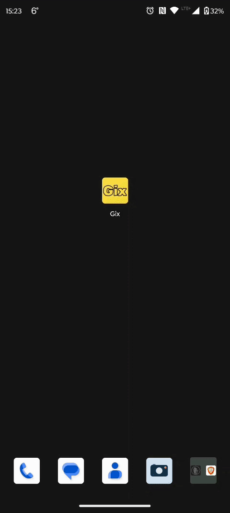
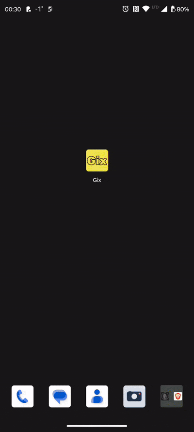
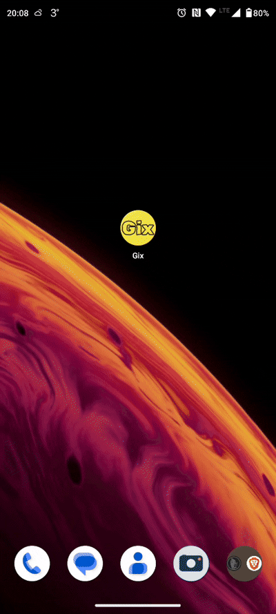

Gix - Instant Gateway to Local Exchange Rates
---

### Key Features

- **Desktop or Mobile**
  The app is created for desktop usage but can easily be exported for mobile.

- **Real-Time Rate Tracking**
  Get live updates from exchange offices in your area - no more outdated info.

- **User-Friendly Interface**
  The clean, intuitive design lets you compare rates in seconds. No clutter, just clarity.

### Technologies / Tools

+ ==GoLang 1.24+==
+ ==Gio Framework==
+ Android SDK (for mobile builds) - iOS is still in development.
+ Github Actions (CI-CD) connection is added for clean code checks (config file may be changed quite frequently).

## How to run it on a PC/Laptop?

1. Go to the location in the folder where _main.go_ is located
2. Run terminal and type: `go build main.go`

## How to run it locally on mobile?

Connect to a mobile phone via USB (Activate USB Debugging settings on Android; Search the web for instructions on your specific smartphone).

1. Go to the location in the folder where _main.go_ is located.
2. Run terminal and type: `go run gioui.org/cmd/gogio -target android -o <path>/<app_name>.apk . -icon <path> .`
   (Terminal will tell you to download some packages if they are not installed yet)
3. Hit enter
4. Add the second command: `<path_to_adb.exe> install -r <path>/<app_name>.apk`

**What is ADB?**
It's part of package tools from _Android SDK Command Line Tools_ - search on the web how to install these essential tools and you're good to go.

  
   
  
<strong>Version #1</strong>

  
   
  
<strong>Version #2</strong>

  
   
  
<strong>Version #3</strong>

