## Architecture

```mermaid
flowchart LR
    A["💻 Gio UI App<br/>(Frontend)"]
    B["🔧 Gix Server<br/>(Backend API)"]
    C[("⚡ Redis<br/>Cache")]
    D[("💾 TimescaleDB<br/>PostgreSQL")]
    E["🌐 Cantor 1<br/>(C1)"]
    F["🌐 Cantor 2<br/>(C2)"]
    G["🌐 Cantor 3<br/>(C3)"]
    
    A -->|"① GET /api/v1/rates"| B
    B -->|"② Check"| C
    C -.->|"③ Hit"| B
    C -->|"③ Miss"| D
    D -->|"④ Strategy"| B
    B -->|"⑤ Scrape"| E
    B -->|"⑤ Scrape"| F
    B -->|"⑤ Scrape"| G
    E -->|"⑥ HTML"| B
    F -->|"⑥ HTML"| B
    G -->|"⑥ HTML"| B
    B -->|"⑦ Cache"| C
    B -->|"⑧ Store"| D
    B -->|"⑨ JSON"| A
    
    classDef frontend fill:#e3f2fd,stroke:#1976d2,stroke-width:3px
    classDef backend fill:#fff3e0,stroke:#f57c00,stroke-width:3px
    classDef db fill:#e8f5e9,stroke:#388e3c,stroke-width:3px
    classDef external fill:#f3e5f5,stroke:#7b1fa2,stroke-width:2px
    
    class A frontend
    class B backend
    class C,D db
    class E,F,G external
```



**Alternative: Simplified Version** (if above is still messy)

```mermaid
graph LR
    A[💻 Frontend] -->|① Request| B[🔧 API Server]
    B -->|② Check| C[(⚡ Cache)]
    C -->|③ Miss| D[(💾 Database)]
    D -->|④ Strategy| B
    B -->|⑤ Scrape| E[🌐 Cantors]
    E -->|⑥ Data| B
    B -->|⑦ Store| C
    B -->|⑧ Archive| D
    B -->|⑨ Response| A
    
    style A fill:#e3f2fd,stroke:#1976d2,stroke-width:3px
    style B fill:#fff3e0,stroke:#f57c00,stroke-width:3px
    style C fill:#e8f5e9,stroke:#388e3c,stroke-width:2px
    style D fill:#e8f5e9,stroke:#388e3c,stroke-width:2px
    style E fill:#f3e5f5,stroke:#7b1fa2,stroke-width:2px
```



### Data Flow

| Step | Action | Description |
|------|--------|-------------|
| **①** | **Request** | Frontend → API: `GET /api/v1/rates?cantor_id=1&currency=EUR` |
| **②** | **Cache Check** | API checks Redis for cached rates (60s TTL) |
| **③** | **Cache Result** | Hit: Return immediately / Miss: Query database |
| **④** | **Get Strategy** | Database returns scraping strategy (C1, C2, or C3) |
| **⑤** | **Scrape** | API executes strategy-specific scraper using Goquery |
| **⑥** | **HTML Response** | External cantor returns exchange rate data |
| **⑦** | **Cache Update** | Store fresh data in Redis (60s expiry) |
| **⑧** | **Archive** | Async save to TimescaleDB for historical analysis |
| **⑨** | **JSON Response** | API → Frontend: Return formatted exchange rates |

### Technology Stack

| Component | Technology | Purpose |
|-----------|-----------|---------|
| **Frontend** | Go + Gio UI | Native cross-platform desktop app |
| **Backend** | Go + net/http | REST API server with hot-reload (Air) |
| **Cache** | Redis | 60-second TTL for rate limiting scraping |
| **Database** | TimescaleDB | Time-series optimized PostgreSQL |
| **Scraping** | Goquery | Strategy Pattern for different cantor layouts |
| **Container** | Docker Compose | Single-command dev environment |

### Quick Start

```bash
# Terminal 1: Start backend (API + DB + Cache)
docker-compose up

# Terminal 2: Start frontend
go run ./cmd/gix/main.go
```

The API will be available at `http://localhost:8080` and the desktop app will connect automatically.
