# Gix - A Go-Powered Currency Rate Scraper

Gix is a desktop application (built with **Gio UI**) for monitoring currency exchange rates, powered by a fully scalable, containerized Go backend.

This project evolved from a simple monolith into a modern Client-Server architecture, capable of handling dozens of different, complex scraping strategies.

## Architecture

The system is now split into two core components:

1.  **Frontend (`cmd/gix/main.go`)**: A "thin" client application built with **Gio UI**. It contains no business logic. Its sole purpose is to render the UI and communicate with the backend via a REST API.
2.  **Backend (`cmd/gix-server/main.go`)**: A **Go REST API** server that manages all business logic, scraping, caching, and database interactions. It is fully containerized by Docker.

Here is the data flow:

```mermaid
flowchart TB
    subgraph Frontend["💻 Frontend - Your PC"]
        A["Gio UI App(cmd/gix/main.go)"]
    end
    
    subgraph Backend["🐳 Backend - Docker Container"]
        B["Gix ServerREST API(cmd/gix-server/main.go)"]
        C[("Redis CacheTTL: 60s")]
        D[("TimescaleDBPostgreSQL")]
    end
    
    subgraph External["🌐 External Cantors"]
        E["Cantor 1Strategy: C1"]
        F["Cantor 2Strategy: C2"]
        G["Cantor 3Strategy: C3"]
    end
    
    A -->|"① GET /api/v1/rates"| B
    B -->|"② Check cache"| C
    C -.->|"③a Hit: Return"| B
    C -.->|"③b Miss: Query"| D
    D -.->|"④ Get strategy"| B
    B -->|"⑤ Scrape HTML"| E
    B -->|"⑤ Scrape HTML"| F
    B -->|"⑤ Scrape HTML"| G
    E -->|"⑥ HTML data"| B
    F -->|"⑥ HTML data"| B
    G -->|"⑥ HTML data"| B
    B -->|"⑦ Store"| C
    B -->|"⑧ Archive"| D
    B -->|"⑨ JSON response"| A
    
    classDef frontendStyle fill:#e3f2fd,stroke:#1976d2,stroke-width:2px
    classDef backendStyle fill:#fff3e0,stroke:#f57c00,stroke-width:2px
    classDef dbStyle fill:#e8f5e9,stroke:#388e3c,stroke-width:2px
    classDef externalStyle fill:#f3e5f5,stroke:#7b1fa2,stroke-width:2px
    
    class A frontendStyle
    class B backendStyle
    class C,D dbStyle
    class E,F,G externalStyle
```


---

## Technology Stack

| Component | Technology | Purpose |
| :--- | :--- | :--- |
| **Frontend** | **Go (Gio)** | Renders the native, cross-platform UI. |
| **Backend** | **Go (net/http)** | Serves the REST API (`/api/v1/cantors`, `/api/v1/rates`). |
| **Environment** | **Docker & Docker Compose** | Runs the entire backend stack (API, DB, Cache) with one command. |
| **Database** | **TimescaleDB (PostgreSQL)** | Stores cantor configuration (strategies, URLs) and archives all historical rates. |
| **Cache** | **Redis** | Caches API responses for 60 seconds to improve performance and reduce scraping. |
| **Scraping** | **Goquery** | Used via the "Strategy Pattern" in `pkg/scrapers` to parse HTML. |
| **Dev Workflow** | **Air** | Provides live hot-reloading for the backend server inside its Docker container. |
| **i18n** | **Go (maps)** | Built-in translation system for the UI, including friendly error messages. |

---

## How to Run (Development)

Running the full application now requires two terminals.

### 1. Run the Backend

The backend (API, Database, Cache) is managed by Docker Compose.

```bash
# This command starts the Go API server (with Air hot-reload),
# the TimescaleDB database, and the Redis cache.
docker-compose up
```
The API server will be available at `http://localhost:8080`.

### 2. Run the Frontend (GUI)

In a **second terminal**, run the Gio application.

```bash
# This starts the desktop app, which will
# connect to the API server at localhost:8080.
go run ./cmd/gix/main.go
```

---

## The Scraping Strategy Pattern

This project solves the "Sysiphean task" of scraping. Instead of simple selectors, it uses a **Strategy Pattern** to handle different website layouts:

1.  The `cantors` table in the database stores a **strategy name** (e.g., `C1`, `C2`, `C3`) for each cantor.
2.  The frontend asks the API for rates: `GET /api/v1/rates?cantor_id=1&currency=USD`.
3.  The backend server (`gix-server`) looks up `cantor_id=1` and finds its strategy is `C1`.
4.  The server's "dispatcher" calls the corresponding function from `pkg/scrapers/`, `scrapers.FetchC1(...)`, which contains the unique scraping logic for that site.
5.  Rates are cached in Redis and returned to the client.

### How to Add a New Cantor

1.  Write a new `FetchC4` function in `pkg/scrapers/scrapers.go`.
2.  Add a `case "C4":` to the `switch` block in `handleGetRates` (`cmd/gix-server/main.go`).
3.  Add a new row to the `cantors` table in your database, setting its `strategy` column to `C4`.

The application will handle the rest automatically.

---

## Demos

<div align="center">
  
  
  
</div>
